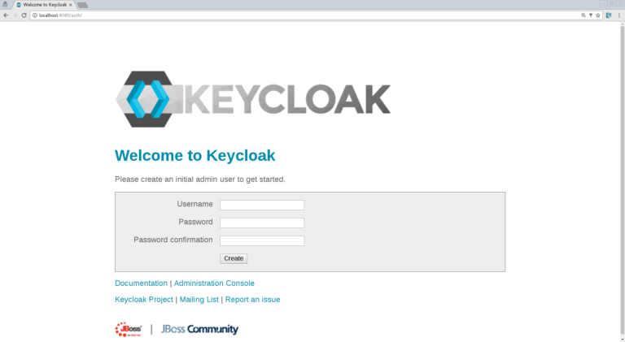
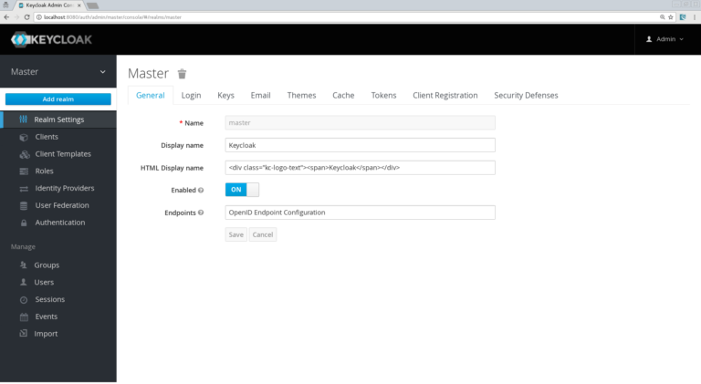
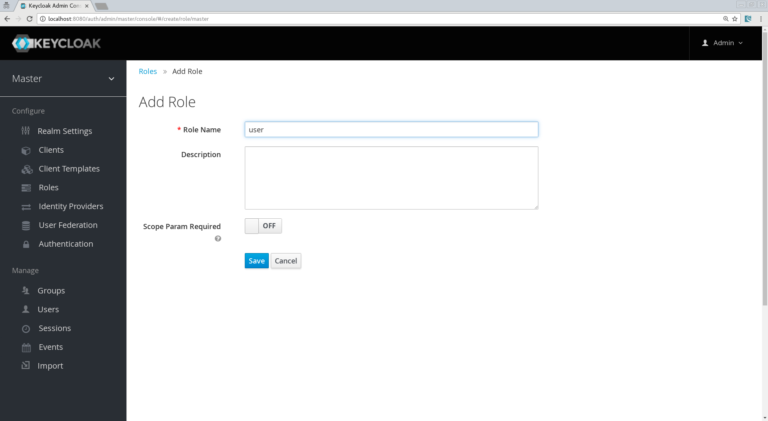
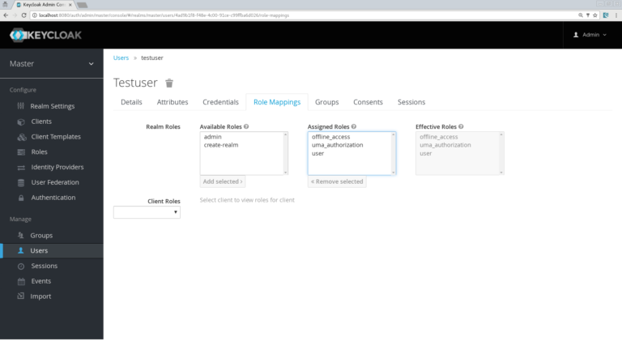
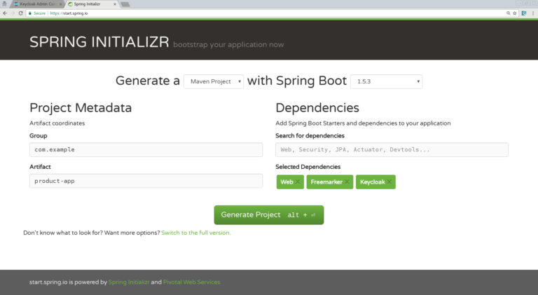
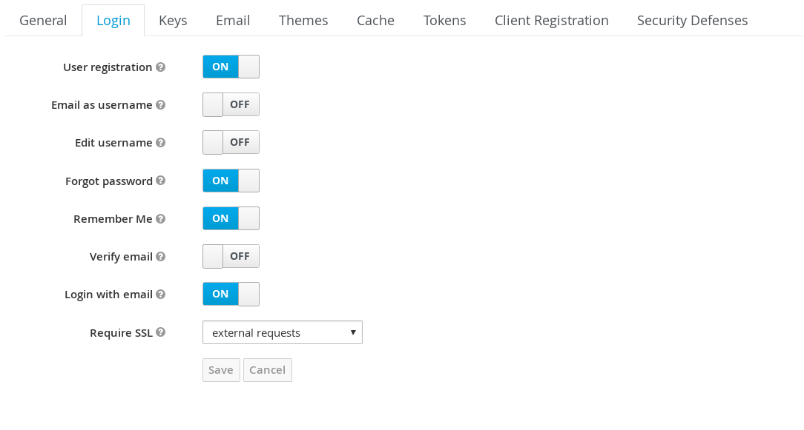
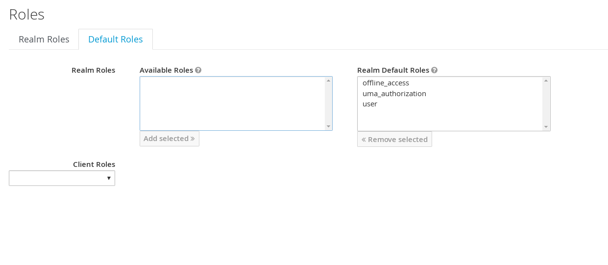
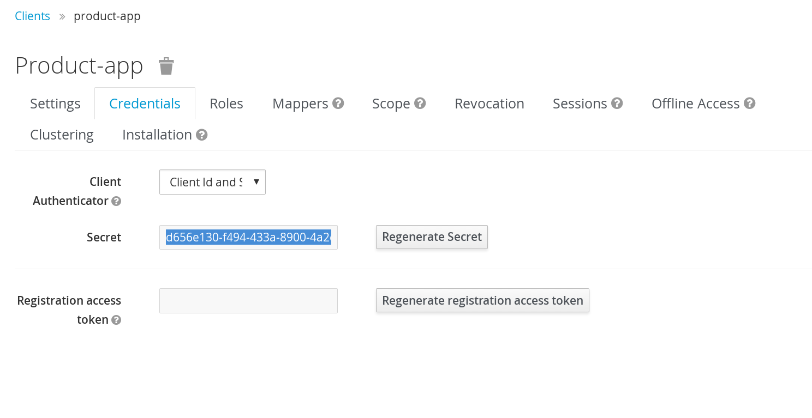
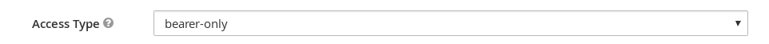

:icons: font
:sectanchors:
:toc: left
:toclevels: 2
:toc-title: Table of Content
:numbered:
:source-highlighter: highlight.js
= Keycloak Workshop

toc::[]

== Installing the Keycloak Server

 * Grab a server binary link:http://www.keycloak.org/downloads.html[here] (Standalone Server)
 * Unzip it
 * Run it `KC_LOCATION/bin/standalone.sh -Djboss.socket.binding.port-offset=100`

[NOTE]
We run it with a port offset of 100 to make sure we don't conflict with 8080 for the apps we will be deploying.

== Creating the initial Admin user

Browse to `http://localhost:8180/auth` and you will see this screen :

Create a new `admin` user with password `admin`.

Now you can access the Keycloak Web Console

== Configuring a new Realm

A good practice is to create a new Realm but you could keep doing this workshop on the `master` Realm.

You can name the realm as you want, in this workshop I will use `canoo`

=== Creating the client, the role, and the user

 * Now we need to define a client, which will be our Spring Boot app. Go to the “Clients” section and click the “create” button. We will call our client “product-app”:
 * On the next screen, we can keep the defaults settings but just need to enter a valid redirect URL that Keycloak will use once the user is authenticated. Put as value: `http://localhost:8081/*`

[WARNING]
Don't forget to save !

Now, we will define a role that will be assigned to our users, let’s create a simple role called `user` :

Now, we need to set his credentials, so go to the credentials tab of your user and choose a password, I will be using “password” for the rest of this workshop, make sure to turn off the “Temporary” flag unless you want the user to have to change his password the first time he authenticates.

Finally proceed to the `Role Mappings` tab and assign the role “user” :

== Running the Spring Boot Product-app

Okay, we are ready to secure our first application, the `product-app` a simple Spring Boot Application using Spring MVC and Freemarker.

And let's create it from scratch !

Browse to link:https://start.spring.io/[The Spring Boot Initialzr] and add the following dependencies :

* Web
* Freemarker
* Keycloak

Import the application in your favorite IDE, I will be using IntelliJ.

Our app will contain only 2 pages:

* An `index.html` which will be the landing page containing just a link to the product page.
* `products.ftl` which will be our product page template and will be only accessible for authenticated user.

Let’s start by creating in simple `index.html` file in `/src/resources/static`:

[source, html]
----

<html>
<head>
    <title>My awesome landing page</title>
</head>
 <body>
   <h1>Landing page</h1>
   <a href="/products">My products</a>
 </body>
</html>

----

Let's create our Controller and Service classes now

[NOTE]
You can create all the classes (Controller, etc) in the same Main file of your Spring Boot.

[source, java]
----
@Component
class ProductService {
   public List<String> getProducts() {
      return Arrays.asList("iPad","iPod","iPhone");
   }
}

@Controller
class ProductController {

   @Autowired ProductService productService;

   @GetMapping(path = "/products")
   public String getProducts(Model model){
      model.addAttribute("products", productService.getProducts());
      return "products";
   }

   @GetMapping(path = "/logout")
   public String logout(HttpServletRequest request) throws ServletException {
      request.logout();
      return "/";
   }
}

----

The final missing piece before you configure Keycloak is the product template (`products.ftl`), create this file in `sec/resources/templates` :

[source, html]
----

<#import "/spring.ftl" as spring>
<html>
<h1>My products</h1>
<ul>
<#list products as product>
    <li>${product}</li>
</#list>
</ul>

    <a href="/logout">Logout</a>

</html>

----

=== Configuring the Keycloak Adapter

Let's start by adding the mandatory fields :

[source, bash]
----

keycloak.auth-server-url=http://localhost:8180/auth
keycloak.realm=canoo
keycloak.public-client=true
keycloak.resource=product-app

----

Now, in this same property file, let's add some security constraints :

[source, bash]
----

keycloak.security-constraints[0].authRoles[0]=user
keycloak.security-constraints[0].securityCollections[0].patterns[0]=/products/*

----

Now we can run the app !

[NOTE]
`mvn clean spring-boot:run` or directly from your IDE.

=== The Login Page

Browse to `http://localhost:8080` and click the `products` link, you should be redirected to the Keycloak Login Page.

Login with the user you create in the first step and after Keycloak should redirect you back to your application showing the list of products.

==== Enabling user registration

Click the `logout` link and go back to the Login page.
Let's tweak our Login page using the Keycloak Web Console.

In the `Realm Settings` screen select the `Login` tab :

Turn on `User Registration`,  go back to the Login page and refresh.

[NOTE]
You can also "play" with the other options like `Remember me` etc ...

Click the `Register new user` link and fill in the form.

Notice that when you will be redirect to the application you will have an error. That's because you new user don't have the role `user`.

Make sure you add the role to your newly created user and let's also make sure the role user is added by default when an user is created :

In the Role section, you have a `Default Roles` tab, from there you can choose the default roles.

==== Making the Client Confidential

Since we have a Server Side Application we can make it Confidential to add an extra security.

Go to your Keycloak Web Console and select your `product-app` client and change the `access type` to `confidential` and save.

You will notice now that you have an extra tab `Credentials` , go there are copy your `secret` :

Add this `secret` to your application properties :

[source, bash]
----

keycloak.credentials.secret=your_secret

----

Also remove the property `keycloak.public-client=true`

[NOTE]
Instead of using a `secret` it is also possible to use a signed JWT but this needs a bit more configuration. Check the documentation for more details.

==== Enabling Spring Security

Keycloak has also support for Spring Security and fits perfectly with the Spring Boot Adapter.

Let's start by adding the Spring Security bits :

[source, xml]
----

<dependency>
   <groupId>org.springframework.boot</groupId>
   <artifactId>spring-boot-starter-security</artifactId>
</dependency>

----

===== Creating a SecurityConfig class

Like any other project that is secured with Spring Security, a configuration class extending WebSecurityConfigurerAdapter is needed. Keycloak provides its own subclass that you can again subclass:

[source, java]
----

@Configuration
@EnableWebSecurity
@ComponentScan(basePackageClasses = KeycloakSecurityComponents.class)
 class SecurityConfig extends KeycloakWebSecurityConfigurerAdapter
{
   /**
    * Registers the KeycloakAuthenticationProvider with the authentication manager.
    */
   @Autowired
   public void configureGlobal(AuthenticationManagerBuilder auth) throws Exception {
      KeycloakAuthenticationProvider keycloakAuthenticationProvider = keycloakAuthenticationProvider();
      keycloakAuthenticationProvider.setGrantedAuthoritiesMapper(new SimpleAuthorityMapper());
      auth.authenticationProvider(keycloakAuthenticationProvider);
   }

   @Bean
   public KeycloakConfigResolver KeycloakConfigResolver() {
      return new KeycloakSpringBootConfigResolver();
   }

   /**
    * Defines the session authentication strategy.
    */
   @Bean
   @Override
   protected SessionAuthenticationStrategy sessionAuthenticationStrategy() {
      return new RegisterSessionAuthenticationStrategy(new SessionRegistryImpl());
   }

   @Override
   protected void configure(HttpSecurity http) throws Exception
   {
      super.configure(http);
      http
            .authorizeRequests()
            .antMatchers("/products*").hasRole("user")
            .anyRequest().permitAll();
   }
}

----

In the property file we can now remove the security constraint (all properties that starts with` keycloak.security-constraints`) that we defined since it's Spring Security that handles this now.

Restart the app and it should just work as before.

===== Injecting the Principal

Just like any other app secured with Spring Security you can easily inject the `Principal` in your controller :

[source, java]
----

@GetMapping(path = "/products")
public String getProducts(Principal principal, Model model){
   model.addAttribute("principal",principal);
   model.addAttribute("products", productService.getProducts());
   return "products";
}

----

And add this to your property file :

[source, bash]
----

keycloak.principal-attribute=preferred_username

----

And in your template :

[source, html]
----
<h1>Hello ${principal.getName()}</h1>
----

== Decomposing the monolith

Instead of returning a hard coded product list, let's create a new application that will serve this list.

=== Installing and configuring Wildfly

* Download and unzip the latest WildFly distribution link:http://download.jboss.org/wildfly/10.1.0.Final/wildfly-10.1.0.Final.zip[here]
* Download the Keycloak WildFly Adapter link:https://downloads.jboss.org/keycloak/3.1.0.Final/adapters/keycloak-oidc/keycloak-wildfly-adapter-dist-3.1.0.Final.zip[here]

==== Installing the WildFly Adapter

* Unzip the Adapter Zip at the root of your WidlFly folder
* Go to the `bin` folder and run : `KC_LOCATION/bin/jboss-cli.sh --file=adapter-install-offline.cli`
* Start the WildFly Server : `KC_LOCATION/bin/standalone.sh -Djboss.socket.binding.port-offset=1`

Your application server is now ready to host Keycloak Secured Application.

=== Deploying the Product-rest app

Make sure to clone this link:https://github.com/sebastienblanc/canoo_apps[repo] .

Then browse to the `product-rest` folder.

To enable Keycloak in our Java EE app we need to do 2 things :

* Update the `web.xml`
* Add a `keycloak.json` descriptor file

==== Configuring the `web.xml`

We need to specify the security constraints and also the login config method :

[source, xml]
----

<?xml version="1.0" encoding="UTF-8" standalone="yes"?>
<web-app xmlns="http://java.sun.com/xml/ns/javaee" xmlns:xsi="http://www.w3.org/2001/XMLSchema-instance" version="2.5" xsi:schemaLocation="http://java.sun.com/xml/ns/javaee http://java.sun.com/xml/ns/javaee/web-app_2_5.xsd">
<display-name>product-rest</display-name>
  <session-config>
    <session-timeout>30</session-timeout>
  </session-config>
  <login-config>
    <auth-method>KEYCLOAK</auth-method>
    <realm-name>canoo</realm-name>
  </login-config>
  <security-role>
    <role-name>user</role-name>
  </security-role>
  <security-constraint>
    <display-name>products</display-name>
    <web-resource-collection>
      <web-resource-name>products</web-resource-name>
      <url-pattern>/rest/products/*</url-pattern>
    </web-resource-collection>
    <auth-constraint>
      <role-name>user</role-name>
    </auth-constraint>
  </security-constraint>
</web-app>

----

Now we need a descriptor for file, let's create it from our Keycloak Web Console.

==== Creating a new Keycloak Client

* Create a new client and call it `product-rest`
* In the next screen , in `Access Type` , select `bearer-only` :

Now go to the `installation` tab and grab the `json` content.

Add this file to `src/main/webapp/WEB-INF`.

Now you can deploy your app to the application server :

* `mvn clean package`
* `cp target/product-rest.war your_wf_folder/standalone/deployments`

So, our rest service is now deployed, to make sure it's secured browse to `http://localhost:8081/product-rest/rest/products` , you should have a `Access Denied` error page.

=== Updating the Product App

Now we need to modify our initial application so that it calls the `product-rest` service. We have to make sure it will pass the authorization bearer in the headers.

Luckily, the Keycloak Spring Security Adapter ships a really useful class, the `KeycloakRestTemplate` :

Let's update our Security Config class by adding this :

[source, java]
----

@Autowired
public KeycloakClientRequestFactory keycloakClientRequestFactory;

@Bean
@Scope(ConfigurableBeanFactory.SCOPE_PROTOTYPE)
public KeycloakRestTemplate keycloakRestTemplate() {
  return new KeycloakRestTemplate(keycloakClientRequestFactory);
}

----

Then, we can inject this bean in our service class :

[source, java]
----

@Autowired
private KeycloakRestTemplate template;

private String endpoint;

@Override
public List<String> getProducts() {
  ResponseEntity<String[]> response = template.getForEntity(endpoint, String[].class);
  return Arrays.asList(response.getBody());
}

----

Restart the app and it should just work as before.

== Adding a Web Application

Now that we have a separate rest service, we can built a third application that will consume this service.

Let's see how a Pure Web App can be secured with Keycloak and consume a secured rest service.

From the apps repo browse to the `angular-product-app` folder, this is AngularJS app.

[NOTE]
For convenience, this app has been wrapped inside a WildFly Swarm Application. But you can put this in any Web Server (Apache, Node, etc...)

=== Creating the `product-web` client

Again, we need to create a new client in the Keycloak Web Console.

In the details screen make sure of this :

* `access Type` must be `public`
* You need to add a `Valid Redirect URI` : `http://localhost:8082/*`
* In `Web Origins` add `*` to deal with CORS.

[WARNING]
Don't forget to save

From the `Installation` tab grab the `keycloak.json` and add it to `src/main/webapp`

=== Enabling CORS support in the `product-rest` services

Before running our Web Application, we need first to enable CORS support in our Rest Service. It's pretty easy, in the `keycloak.json` of the `product-rest` add this :

[source, javascript]
----

"enable-cors" : true

----

Repackage and redeploy the app.

=== Running the Web Application

Running the Web Application can be done with this command : `mvn clean wildfly-swarm:run`

Access the Web App : `http://localhost:8082` , note that if you open this in a tab of a browser where you were already connected with the `product-app` you won't need to authenticate ;)

== Conclusion

I hope you enjoyed this workshop, here is a list of useful resources :

* link:https://www.gitbook.com/book/keycloak/documentation[Keycloak Documentation]
* link:https://github.com/keycloak/keycloak-quickstarts[Keycloak Quickstarts]
* link:https://developers.redhat.com/blog/2017/05/25/easily-secure-your-spring-boot-applications-with-keycloak/[Blog Post about Keycloak and Spring Boot]
